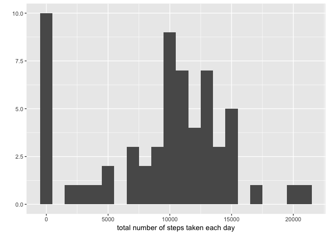
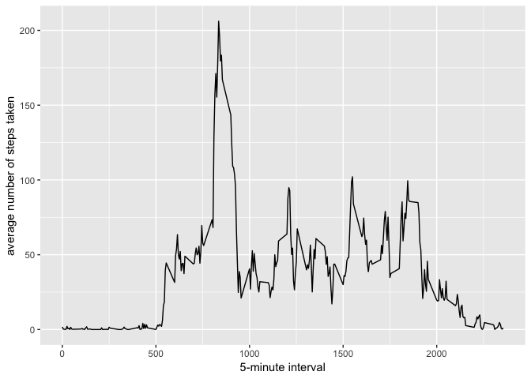
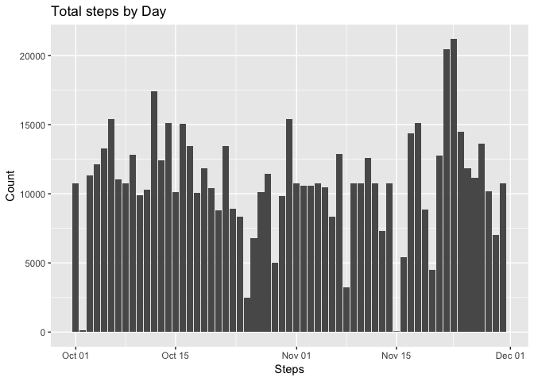
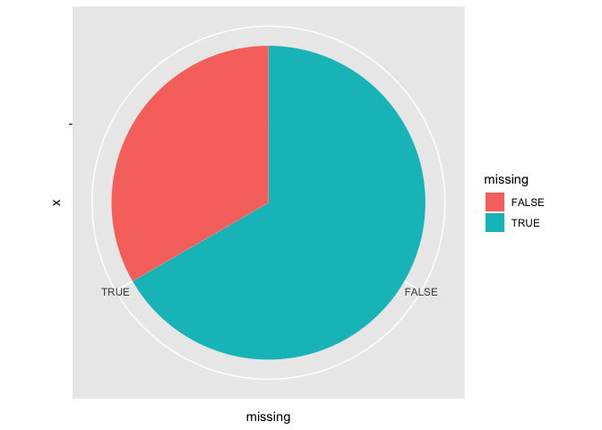
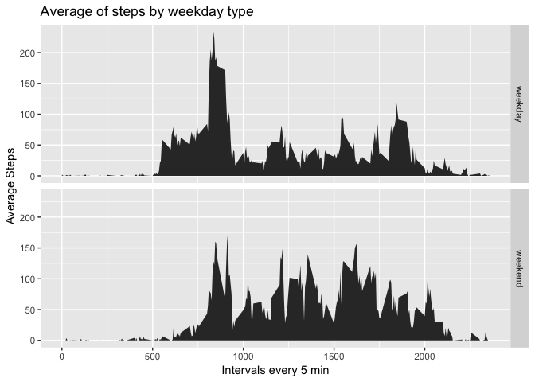

### Reproducible Research: Peer Assessment 1

## Loading and preprocessing the data


```r
unzip(zipfile = "activity.zip")
data <- read.csv("activity.csv")
```

## What is mean total number of steps taken per day?


```r
library(ggplot2)
total.steps <- tapply(data$steps, data$date, FUN = sum, na.rm = TRUE)
qplot(total.steps, binwidth = 1000, xlab = "total number of steps taken each day")
```

<!-- -->


```r
mean(total.steps, na.rm = TRUE)
```

```
## [1] 9354.23
```

## What is the average daily activity pattern?


```r
library(ggplot2)
means <- aggregate(x = list(steps = data$steps), 
                   by = list(interval = data$interval), 
                   mean, na.rm = TRUE)
ggplot(data = means, aes(x = interval, y = steps)) + 
       geom_line() + xlab("5-minute interval") + 
       ylab("average number of steps taken")
```

<!-- -->


```r
median(total.steps, na.rm = TRUE)
```

```
## [1] 10395
```

##Which 5-minute interval, on average across all the days in the dataset, contains the maximum number of steps?


```r
means[which.max(means$steps), ]
```

```
##     interval    steps
## 104      835 206.1698
```

## Imputing missing values

1. Calculate and report the total number of missing values in the dataset (i.e. the total number of rows with `NA`s)


```r
    sum(!complete.cases(data))
```

```
## [1] 2304
```


2. Devise a strategy for filling in all of the missing values in the dataset. The strategy does not need to be sophisticated. For example, you could use the mean/median for that day, or the mean for that 5-minute interval, etc.


```r
library(dplyr)
```

```
## 
## Attaching package: 'dplyr'
```

```
## The following objects are masked from 'package:stats':
## 
##     filter, lag
```

```
## The following objects are masked from 'package:base':
## 
##     intersect, setdiff, setequal, union
```

```r
noNaSteps <- data %>% group_by(interval) %>% mutate(noNaSteps=ifelse(is.na(steps),mean(steps,na.rm = TRUE),steps))
```

3. Create a new dataset that is equal to the original dataset but with the missing data filled in.


```r
activityData <- noNaSteps[2:4]
activityData
```

```
## # A tibble: 17,568 x 3
## # Groups:   interval [288]
##    date       interval noNaSteps
##    <fct>         <int>     <dbl>
##  1 2012-10-01        0    1.72  
##  2 2012-10-01        5    0.340 
##  3 2012-10-01       10    0.132 
##  4 2012-10-01       15    0.151 
##  5 2012-10-01       20    0.0755
##  6 2012-10-01       25    2.09  
##  7 2012-10-01       30    0.528 
##  8 2012-10-01       35    0.868 
##  9 2012-10-01       40    0     
## 10 2012-10-01       45    1.47  
## # … with 17,558 more rows
```


4. Make a histogram of the total number of steps taken each day and Calculate and report the **mean** and **median** total number of steps taken per day. Do these values differ from the estimates from the first part of the assignment? What is the impact of imputing missing data on the estimates of the total daily number of steps?


```r
dailySteps <- aggregate(activityData$noNaSteps,
                        by=list(activityData$date),sum)
names(dailySteps) <- c("date","steps")
ggplot(dailySteps,aes(as.Date(date),steps))+
    geom_bar(stat="identity") +labs(
    title="Total steps by Day",x="Steps",y="Count"
)
```

<!-- -->

Interesting graph about missing values:


```r
missing <- is.na(data$steps)
# Missing table
missingTable <- table(missing)
missingTable
```

```
## missing
## FALSE  TRUE 
## 15264  2304
```


```r
mtdf <- as.data.frame(missingTable)
 ggplot(mtdf, aes(x="", y=missing, fill=missing))+geom_bar(width = 1, stat = "identity")+
     coord_polar("y", start=0)
```

<!-- -->


### Are there differences in activity patterns between weekdays and weekends?

For this part the `weekdays()` function may be of some help here. Use
the dataset with the filled-in missing values for this part.

1. Create a new factor variable in the dataset with two levels -- "weekday" and "weekend" indicating whether a given date is a weekday or weekend day.


```r
data <- transform(data,date=as.Date(as.character(date)))
weekDaysData <- data %>% 
                mutate(weekDay = weekdays(date),
                type=ifelse(weekdays(date) %in% c("Saturday","Sunday"),"weekend","weekday"))
head(weekDaysData)
```

```
##   steps       date interval weekDay    type
## 1    NA 2012-10-01        0  Monday weekday
## 2    NA 2012-10-01        5  Monday weekday
## 3    NA 2012-10-01       10  Monday weekday
## 4    NA 2012-10-01       15  Monday weekday
## 5    NA 2012-10-01       20  Monday weekday
## 6    NA 2012-10-01       25  Monday weekday
```

1. Make a panel plot containing a time series plot (i.e. `type = "l"`) of the 5-minute interval (x-axis) and the average number of steps taken, averaged across all weekday days or weekend days (y-axis). The plot should look something like the following, which was created using **simulated data**:


```r
weekDaySteps <- aggregate(weekDaysData$steps,
                          by=list(weekDaysData$type,weekDaysData$interval),
                          mean,
                          na.rm=TRUE)
names(weekDaySteps) <- c("weekType","interval","steps")
ggplot(weekDaySteps,aes(x=interval,y=steps))+
        geom_area()+
        facet_grid(weekType~.) +
        labs(title="Average of steps by weekday type", 
             x="Intervals every 5 min",y="Average Steps")+
  scale_fill_manual(values=c("#999999", "#E69F00"))
```

<!-- -->

